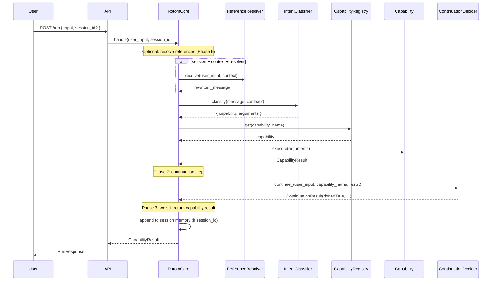
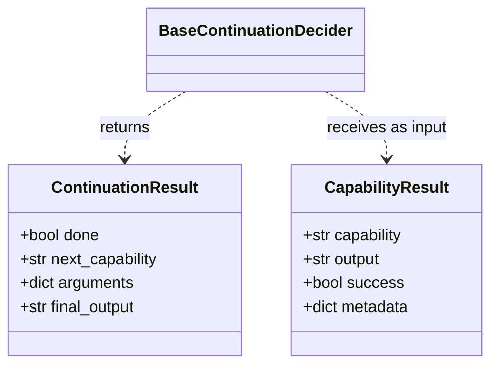

# Phase 7: Tool Result Injection — Flow and Diagrams

This document explains the new continuation step and how it fits into the request flow. Phase 7 adds a **continuation decider** that runs after every capability execution; by default it is a no-op so the user still receives the capability output unchanged.

---

## High-Level Request Flow (Including Phase 7)

**What Phase 7 changes:** After `CapabilityResult` is produced, RotomCore calls `continuation_decider.continue_(...)` and receives a `ContinuationResult`. In Phase 7 we do **not** use that to change the response: the user still gets the capability output. The call establishes the contract so Phase 8 can use `done` / `next_capability` to loop.

---

## Continuation Contract (Structured Output)

The continuation decider returns a **structured** object, not free-form text:

- **done:** If true, we are done (single step or end of loop). If false, Phase 8 will run `next_capability` with `arguments`.
- **next_capability / arguments:** Used in Phase 8 to run another capability without a new user message.
- **final_output:** Optional synthesized reply; in Phase 7 we ignore it and always return the capability output.

---

## Default vs LLM Continuation Decider

| Implementation        | Behavior                                                                 | When used                    |
|-----------------------|--------------------------------------------------------------------------|-----------------------------|
| **NoOpContinuationDecider** | Always returns `done=True`, no LLM call.                                | Default in Phase 7 (production). |
| **LLMContinuationDecider**  | Sends result to LLM; parses JSON to get `done`, `next_capability`, etc. | Tests; Phase 8 when we enable looping. |

**Where the types live (Phase 7):**
- `app/agents/continuation/base_continuation_decider.py` — abstract interface (`BaseContinuationDecider`)
- `app/agents/continuation/no_op_decider.py` — no-op implementation (default)
- `app/agents/continuation/llm_decider.py` — LLM-backed implementation
- `app/models/continuation_result.py` — structured result model

---

## Where the Continuation Step Fits in RotomCore

1. Receive input, get context (if session).
2. Optional: resolve references (Phase 6).
3. Classify intent.
4. Validate, resolve capability, execute capability → get `result`.
5. Add timing and session_id to `result`.
6. **Phase 7:** If `continuation_decider` is not None, call `continue_(user_input, capability_name, result)`. (We do not yet use the return value to change the response.)
7. Append to session memory (if session_id).
8. Return `result` to the caller.

The continuation step is **after** execution and **before** appending to memory, so the decider sees the full capability result (including success/failure and output).
