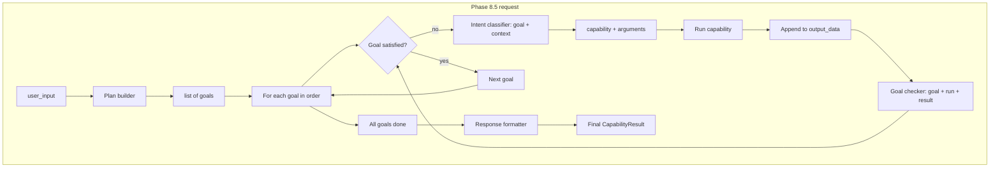

# Phase 8.5: Goals-Based Multi-Step — Plan and Flow

Phase 8.5 redesigns multi-step execution by replacing the **continuation decider** (Phase 7/8) with a **goals-based pipeline**: a plan builder produces a list of user-level goals; we satisfy each goal in order using the **intent classifier** (per step) and a **goal checker** (per goal); we accumulate **output_data**; and a **response formatter** produces the final user reply. This keeps the decider’s “done?” problem out of the loop and gives clear structure and a single narrative at the end.

---

## Why Phase 8.5

Phase 8’s continuation decider is asked to do two things at once: “Is the user’s request done?” and “If not, what’s the next capability and arguments?” That combined prompt has proven unreliable (e.g. the model often returns “done” after one step). Phase 8.5 splits responsibility:

- **What to run next** → intent classifier (current goal + context → capability + arguments).
- **Is this goal satisfied?** → goal checker (goal + last run + result → satisfied: true/false).
- **Final answer** → response formatter (user_input + output_data + goals → narrative).

Goals are stable and user-meaningful; we never advance to the next goal until the goal checker says the current one is satisfied.

---

## High-Level Flow

- **Plan builder:** One LLM call: `user_input` → structured list of **goals** (e.g. “Capture original text”, “Summarize the text”, “Get word count of summary and print it”).
- **Per goal:** While the **goal checker** says “not satisfied”: **classifier**(current goal, context) → capability + args → run capability → append to **output_data** → **goal checker**(goal, what we ran, result) → satisfied? When satisfied, advance to next goal.
- **End:** When all goals are satisfied, **response formatter**(user_input, output_data, goals) → final user-facing response (e.g. narrative or structured); return as `CapabilityResult` (optionally with `synthesized` metadata).

---

## Components

### 1. Plan builder (LLM)

- **Input:** `user_input` (full user message).
- **Output:** Structured list of **steps**. Each step has at least a **goal** (short description); optionally **store_output_as** and **use_from_memory**.
- **Contract:** JSON array of goal strings and/or objects with "goal", "store_output_as", "use_from_memory". See [PHASE8_5_ARTIFACTS.md](PHASE8_5_ARTIFACTS.md). Parsed once at the start; goals are not revised mid-request in the baseline design (optional replan can be added later).

### 2. Intent classifier (existing, used per step)

- **Input:** Current **goal** (and optional **context**). Context always includes original user input; it may include "Content of '<key>' (from a previous step)" when the plan declares **use_from_memory**, or "Previous step result" otherwise. The classifier returns the right capability + arguments (e.g. word_count with text = the injected artifact when use_from_memory is set).
- **Output:** `{ "capability": string, "arguments": dict }` as today.
- **Usage:** Called once per capability run (within a goal, possibly multiple times until the goal is satisfied).

### 3. Goal checker (new, lightweight LLM)

- **Input:** Current **goal**, what we just ran (capability name, result summary), and optionally the last full result.
- **Output:** `{ "satisfied": true | false }`. Optionally `{ "satisfied": true, "output_snippet": "..." }` to append to output_data for this goal.
- **Responsibility:** Only “is this goal satisfied?” — no “next capability.” We do not advance to the next goal until satisfied is true.

### 4. Output_data (accumulated structure)

- **Format:** e.g. JSON object or list that we append to as we run capabilities (e.g. `{ "word_count_original": 146, "summary": "...", "word_count_summary": 12 }` or a list of `{ "goal": "...", "capability": "...", "output": "..." }`).
- **Updated:** After each capability run (and optionally when the goal checker returns an output_snippet).
- **Consumed:** By the response formatter at the end.

### 5. Response formatter (LLM)

- **Input:** Original `user_input`, **output_data** (accumulated results), and the list of **goal strings** (for display).
- **Output:** A single user-facing response (narrative or structured) that we return as the `output` of the final `CapabilityResult`, with `metadata["synthesized"] = True` (or equivalent).

### 6. Artifact store (request-scoped)

- **Purpose:** Pass prior step outputs to later goals without putting all prior results in every prompt. Used when the plan declares **store_output_as** (producer step) and **use_from_memory** (consumer step).
- **Lifecycle:** A dict created at the start of the goals loop and used only for that request; no persistence, no explicit clear. See [PHASE8_5_ARTIFACTS.md](PHASE8_5_ARTIFACTS.md).

---

## Where This Lives

- **Plan builder:** New abstraction (e.g. `PlanBuilder` / `LLMPlanBuilder`) in the agent layer; called once at the start of the Phase 8.5 path.
- **Goal checker:** New abstraction (e.g. `GoalChecker` / `LLMGoalChecker`) in the agent layer; called after each capability run within a goal.
- **Response formatter:** New abstraction (e.g. `ResponseFormatter` / `LLMResponseFormatter`) in the agent layer; called once when all goals are satisfied.
- **Loop and output_data:** Inside RotomCore (or a dedicated orchestrator used by RotomCore) when Phase 8.5 mode is enabled: goals loop, classifier-per-step, goal checker, output_data append, then formatter.
- **Guard:** Retain a max-steps or max-iterations guard (e.g. total capability runs per request) to avoid runaway execution.

---

## Relation to Phase 7 and Phase 8

- **Phase 7** (continuation contract) and **Phase 8** (continuation-decider loop) remain in the codebase until Phase 8.5 is implemented and switched on. Phase 8.5 can be introduced behind a configuration flag (e.g. “goals-based” vs “continuation-decider”).
- When Phase 8.5 is the default multi-step path, the **continuation decider** can be deprecated or removed; the **continuation contract** (done, next_capability, arguments, final_output) is replaced by **goals**, **goal checker (satisfied)**, and **response formatter**.

---

## Implementation Phases (summary)

1. **Schema and interfaces:** Define Plan (list of goals), GoalChecker result (satisfied, optional output_snippet), ResponseFormatter input/output. Add abstract PlanBuilder, GoalChecker, ResponseFormatter.
2. **LLM plan builder:** Implement LLM that returns a list of goals from user_input; parse and validate.
3. **LLM goal checker:** Implement LLM that returns satisfied true/false (and optional snippet) given goal + last run + result.
4. **LLM response formatter:** Implement LLM that returns final response from user_input + output_data + goals.
5. **RotomCore (or orchestrator):** Add Phase 8.5 path: plan builder → for each goal → while not satisfied: classifier → run → append output_data → goal checker; when all goals done → response formatter → return.
6. **Service layer and config:** Wire plan builder, goal checker, formatter; add config to choose Phase 8 vs Phase 8.5 for multi-step.
7. **Fast path (optional):** Single-goal or “obvious” single-step requests skip plan builder and use classifier once.
8. **Tests and docs:** Unit tests for plan builder, goal checker, formatter (mocked LLM); integration test for full goals-based flow; update ARCHITECTURE.md and AI_CONTEXT.md.

---

## Example (from earlier user request)

**User input:** “Determine how many words are in this text, summarize the text, print the summarization, and print the number of words in the summarization: [long paragraph].”

**Plan builder output (goals):**

1. Capture original text.
2. Get word_count of original text (and print it).
3. Summarize the original text.
4. Print the summarization.
5. Get word_count of summarized text and print it.

**Execution:** For goal 1, classifier might say “echo” with message = paragraph (capture); goal checker says satisfied. For goal 2, classifier says “word_count” with text = paragraph; run; append to output_data; goal checker says satisfied. Goals 3–5 proceed similarly, using previous results as context (e.g. “summarizer_stub” with text = paragraph, then “word_count” with text = summary). **Response formatter** receives output_data (word counts, summary, etc.) and goals, and produces the final narrative for the user.

---

## Next Steps

- Implement Phase 8.5 according to the implementation phases above.
- Keep Phase 8 (continuation decider) available until Phase 8.5 is stable and default.
- Update [PHASE8_FLOW.md](PHASE8_FLOW.md) or add a note that Phase 8.5 supersedes it for the goals-based path.
