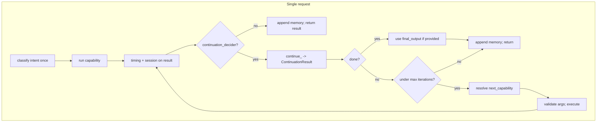

# Phase 8: Iterative Reasoning Loop — Flow and Diagrams

Phase 8 adds a **bounded multi-step loop** inside RotomCore. After each capability run, the continuation decider is consulted; when it returns `done=False` with `next_capability` and `arguments`, RotomCore runs that capability and repeats until `done=True` or a **max-iteration** limit. The continuation contract is defined in Phase 7; see [PHASE7_FLOW.md](PHASE7_FLOW.md) for the `ContinuationResult` shape and decider interface.

---

## High-Level Request Flow (Including Phase 8)

One request still enters as `handle(user_input, session_id)` and returns a single `CapabilityResult`. The difference is that the middle section can repeat.

- **Classify once:** Intent classification runs only at the start of the request. The loop is driven by the continuation decider, not by re-classifying.
- **Loop body:** Resolve capability → validate arguments → execute → add timing/session → call continuation decider → append this step to session memory → branch on `done` / max iterations / validity of next step.
- **Guard:** `MAX_CONTINUATION_ITERATIONS` (in `rotom_core.py`) caps how many capability runs can occur in one request. When the limit is reached, we return the last result.

---

## Where the Loop and Guard Live

- **File:** [app/agents/rotom_core.py](../app/agents/rotom_core.py)
- **Constant:** `MAX_CONTINUATION_ITERATIONS` (default 5)
- **Logic:** Inside `handle()`, after building initial `capability_name` and `arguments` from the classifier, a `while iteration < MAX_CONTINUATION_ITERATIONS` loop runs the capability, calls the decider, appends memory, then either returns or sets `capability_name`/`arguments` for the next iteration.

---

## Session Memory in the Loop

- **First iteration:** We append the user message (original `user_input`) and one assistant entry (capability name + output summary).
- **Subsequent iterations:** We append only an assistant entry per step (no new user message). So the transcript for one request is: user said X → we ran A → we ran B → … This keeps context accurate for the next user request.

---

## When We Stop (Exit Loop)

1. **No continuation decider:** Single-step behavior; we return after the first capability run.
2. **Decider returns `done=True`:** We optionally replace the returned result’s `output` with `cont.final_output` if set, and add `metadata["synthesized"] = True`; then return.
3. **Iteration count >= MAX_CONTINUATION_ITERATIONS:** We return the last capability result.
4. **Decider returns `done=False` but next step invalid:** Missing or empty `next_capability`, non-dict `arguments`, capability not in registry, or argument validation failure → we log and return the last result (no crash, no infinite loop).

---

## Default Behavior (No Multi-Step)

The service layer still wires `NoOpContinuationDecider()` by default, which always returns `done=True`. So with default wiring the loop runs at most once per request. To enable multi-step reasoning, swap in `LLMContinuationDecider` (and pass `llm_client` and any needed metadata) in the service layer; no API or schema change is required.

---

## Next Steps for Phase 8

1. **Wire LLM-backed continuation in the service layer**
   - Replace the default `NoOpContinuationDecider` with `LLMContinuationDecider` when constructing `RotomCore` in the service/factory module (using the loop contract described above).
   - Add a configuration switch (for example, an environment variable) to toggle between no-op and LLM-backed deciders so multi-step behavior can be rolled out gradually.

2. **Improve observability of the iterative loop**
   - Extend logging around each iteration (capability name, iteration index, whether `done` was returned, and whether the max-iteration guard fired) so continuation behavior is easy to debug in real runs.
   - Optionally expose basic counters/timers via the existing metrics/logging stack and adjust `MAX_CONTINUATION_ITERATIONS` based on observed behavior rather than a fixed constant.

3. **Add end-to-end multi-step tests**
   - Build tests that wire a mocked `LLMContinuationDecider` into `RotomCore` and drive a 2–3 step flow (for example, first `done=False` with a `next_capability`, then `done=True` with or without `final_output`).
   - Use these tests to cover both the happy path (valid next capability and arguments) and guardrails (invalid next step falls back to the latest capability result).

4. **Document concrete multi-step examples**
   - Add a short section that walks through at least one realistic multi-step scenario (for example, "draft → review → summarize") and shows how the continuation decider chooses `next_capability` and `arguments` at each step.
   - Keep these examples aligned with the actual capabilities registered in the system so they can double as design documentation for future contributors.
